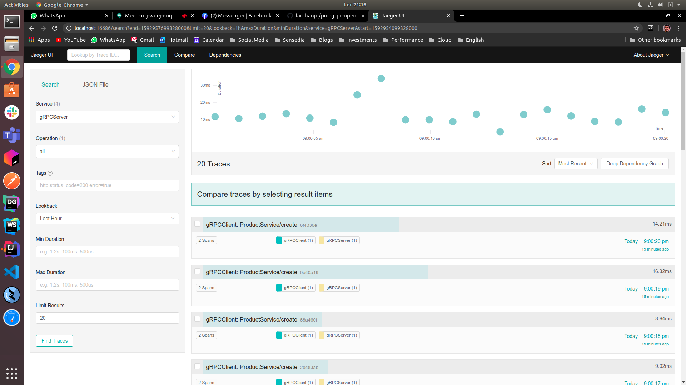

# Overview

This is a poc using gRPC and Jaeger as Opentracing implementation

# Stack

[Java 11](https://www.oracle.com/java/technologies/javase-jdk11-downloads.html)

[Jaeger](https://www.jaegertracing.io/)

[gPRC](https://grpc.io/)

# Pre-requirements

## Jaeger

`docker run -d --restart=always --net=host --name=jaeger jaegertracing/all-in-one`

## Jaeger UI

`http://localhost:16686/search`

# Testing 

1º Run the command bellow:

`mvn clean package`

2º Run the server, to do that run the `gRPCServer.class`

3º Run the client, to do that run the `gRPCClient.class`

4º Open the [Jaeger UI](http://localhost:16686/search) and find the traces, etc.

# Be Happy